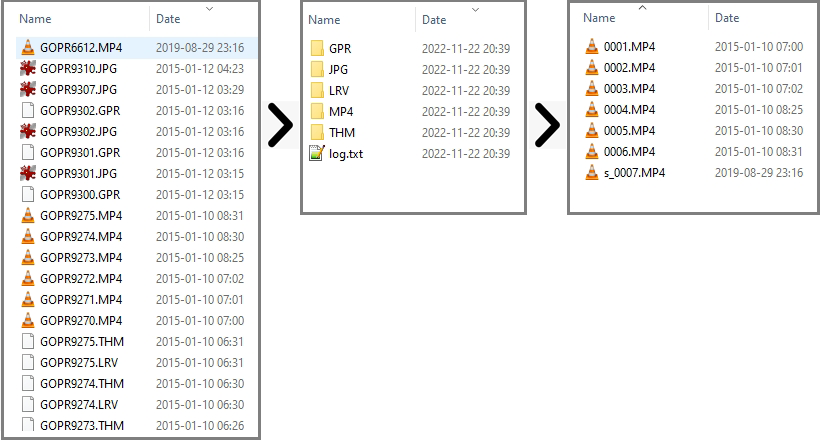
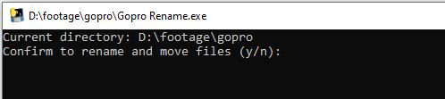
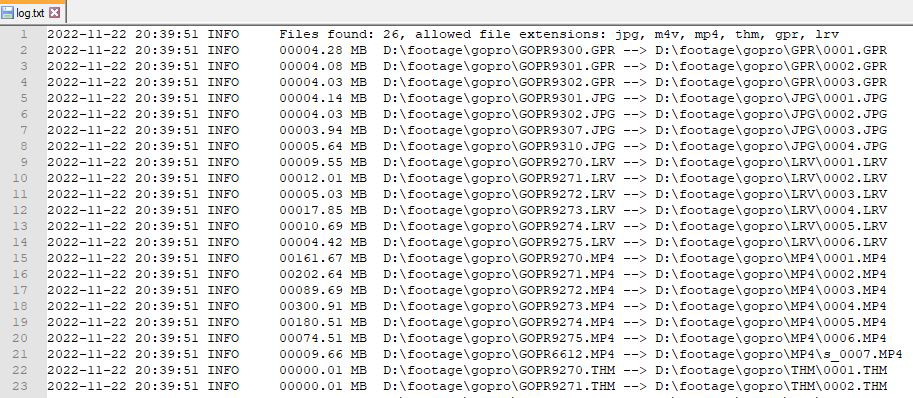

# Gopro File Manager

A simple script to organize files from Gopro SD card in more convenient way. Default [Gopro file naming convention](https://community.gopro.com/s/article/GoPro-Camera-File-Naming-Convention) are not very user friendly, esspecialy, then it comes to working with files in postproduction. Usually, I was using Total Commander’s multi-rename tool to bulk rename my video files before importing  them into my video editing software.

## Features of script:
1. **Moves** allowed type of files to separate folder by it’s extension (i.e. all jpgs are moved to foder JPG, mp4s to folder MP4, etc)
2. **Renames** moved files by using counter starting from 1, in a format 0001, 0002 (ie. 0001.mp4)
3. **Generates a log** file (*log.txt*) with original and new file paths, name and file size.
4. **Adds a special prefix** to name of small video files to indicate potential garbage.

This scrip can be easily modified to work with other type of files. 

## Usage example
I use this script as an exe program. To rename files in a specific directory all you need to do is just drag and drop exe file to directory and execute it. I found this way more convenient, instead of building a GUI.

To build an exe file from python code you can use tools such: *py2exe*, *pyinstaller*.

Here is already prepared exe file which you can **download and use**: [gp_rename.exe](https://github.com/gaumin/gopro-file-manager/blob/main/exe/Gopro%20Rename.exe)

## Possible future improvements:
- [ ]	When executing a script let user to enter a prefix which will be included into file name (ie. prefix “surfing” for result “surfing_0002.mp4”)
- [ ]	Develop functionality to revert file names back to original ones (by using log file)

## Screenshoots

## Contributing
1. Fork it (https://github.com/gaumin/gopro-file-manager/fork)
2. Create your feature branch (`git checkout -b feature/fooBar`)
3. Commit your changes (`git commit -am 'Add some fooBar'`)
4. Push to the branch (`git push origin feature/fooBar`)
5. Create a new Pull Request
